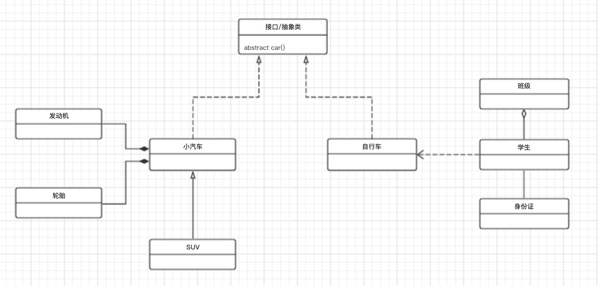

### 单一职责（功能）原则（Single Responsibility Principe）：

该原则即一个类应该只负责一个职责，如果一个类负责很多个职责，那么这些职责之间就耦合在一起，当一个职责发生变化的时候，就会对其它的职责带来影响，这样的设计是脆弱的，会影响其复用性。

### 里氏替换原则（Liskov Substitution Principle）：

任何基类可以出现的地方，子类一定可以出现。它是类复用的基石。

### 依赖倒置原则（Dependence Inversion Principle）：

依赖抽象，而不是依赖于具体实现。即高层次的模块不应该依赖于低层次的模块，它们都依赖于抽象。而抽象不依赖于具体的实现，实现应该依赖于抽象。

### 接口隔离原则（Interface Segregation Priciple）:

客户端不应该依赖它不需要的接口。

**如果一个类根本不需要实现一个接口的所有方法就可以实现该类的功能**。那么这种情况下，一般都是需要进行接口的拆分，来构造出一个新接口，把那些必须实现的方法放到接口里去，把那些可以实现也可以不实现的方法作为另一个或几个接口，或者直接丢弃。

对于接口的拆分，它把一个大的接口拆分为几个小的接口，其中每一个类只需要实现这个小接口即可完成对应的功能。而这些小接口之间是彼此隔离的，它们不应该定义相同的功能。

### 迪米特原则（Law of Demeter）：

一个对象应该尽可能对其它对象有尽可能少的理解。主要目的是为了降低类之间的耦合，每个类都尽可能少的减少对其他类的依赖。

### 开闭原则（Open Closed Principle）:

对扩展开放，对修改封闭。它对软件的可复用性提供了一个非常重要的指导思想。

### UML 类图解释

- 车的类图结构为 `abstract` 抽象类
- 有两个继承类：小汽车和自行车，它们之间的关系为实现关系，使用带**空心箭头的虚线**表示
- 小汽车与 SUV 之间也是继承关系，它们之间的关系为泛化关系，使用带**空心箭头的实线**表示
- 小汽车与发动机和轮胎之间是组合关系，使用带 **实心箭头的实线表示**表示
- 学生与班级之间是聚合关系，使用带 **空心箭头的实线**表示
- 学生与身份证之间的关联关系，使用一根**实线**表示
- 学生上学需要用到自行车，与自行车是一种依赖关系，使用**带箭头的虚线**表示