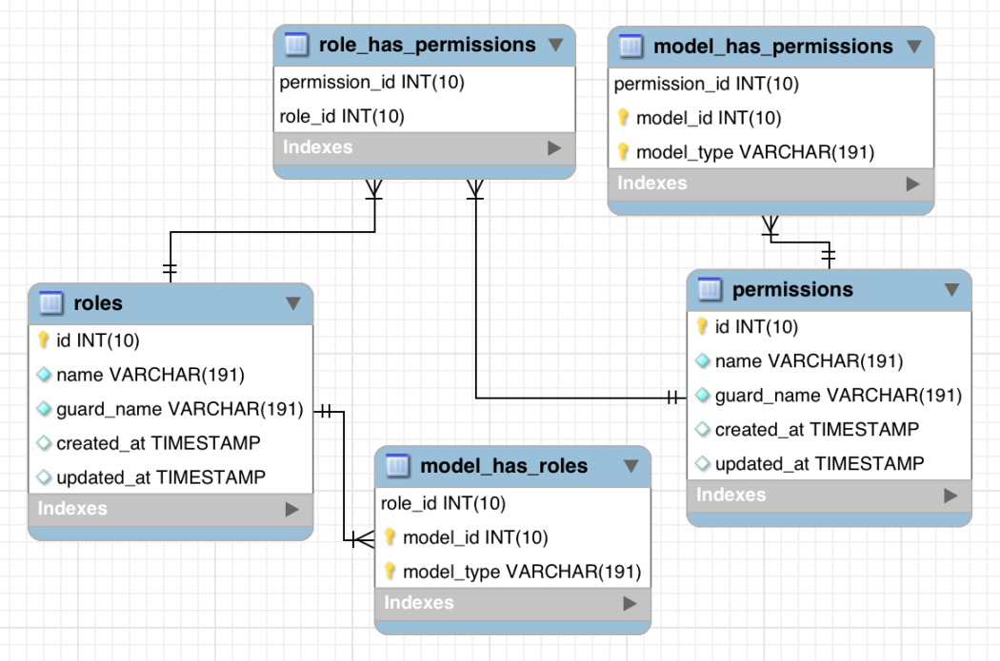

# Laravel5.5- 开发实战进阶

 ### 基础布局 `resources/views/layouts`

   - app.blade.php —— 主要布局文件，项目所有页面都将继承于此页面
   - _header.blade.php —— 布局的头部区域文件，负责顶部导航栏区块
   - _footer.blade.php —— 布局的尾部区域文件，负责底部导航区块

 ### 注册登录

   Laravel 自带用户认证功能，`php artisan make:auth` 生成注册登录、重置密码等功能

   ``` php
   //web.php
   Auth::routes();
   
   //等同于
   // Authenication Routes
   Route::get('login','Auth\LoginController@showLoginForm')->name('login');
   Route::post('login','Auth\LoginController@login');
   Route::post('logout','Auth\LoginController@logout')->name('logout');
   
   // Registration Routes
   Route::get('register','Auth\RegistrerController@showRegistrationForm')->name('register');
   Route::post('register','Auth\RegisterController@register');
   
   //Password Reset Routes
   Route::get('password/reset','Auth\ForgotPasswordController@showLinkRequestForm')->name('password.request');
   Route::post('password/email','Auth\ForgotPasswordController@sendResetLinkEmail')->name('password.email');
   Route::get('password/reset/{token}','Auth\ResetPasswordController@showResetForm')->name('password.reset');
   Route::post('password/reset','Auth\ResetPasswordController@reset');
   ```

   使用 `Auth::routes();` 路由后需要修改如下几个文件的跳转地址：

   ```php
   app\Http\Controllers\Auth\LoginController.php
   app\Http\Controllers\Auth\RegisterController.php
   app\Http\Controllers\Auth\ResetPasswordController.php
   app\Http\Middleware\RedirectIfAuthenticated.php
   ```

 ### 注册验证码

composer 引入包： `composer require "mews/captcha:~2.0"` ，非 homestead 环境需要在 `php.ini` 中开启 `fileinfo` 扩展

生成配置文件： `php artisan vendor:publish --provider='Mews\Captcha\CaptchaServiceProvider'`

`captcha_src()` 方法是 mews/captcha 提供的辅助方法，用于生成验证码图片链接

给 `app\Http\Controllers\Auth\RegisterController.php` ，添加验证码验证规则
 ### 个人页面

给 users 表添加字段，使用　`php artisan make:mirgation add_avatar_and_introduction_to_users_table --table=users` ，命名迁移文件需要加上前缀，遵照如　`add_column_to_table`　这样的命名规范

处理表单验证的方法，可以使用表单请求验证（FormRequest）是 Laravel 框架提供的用户表单数据验证方案，能处理更为复杂的验证逻辑，更加适用于大型程序。

`php artisan make:request UserRequest`

表单请求验证（FormRequest）的工作机制，是利用 Laravel 提供的依赖注入功能，在 `UsersController` 中定义的 `update(User $user,UserRequest $request)` 方法，传参 `UserRequest` ，这将触发表单请求类的自动验证机制并调用 `rules()` 方法，当验证通过时，才会执行控制器 `update()` 方法中的代码，否则抛出异常，并重定向至上一个页面，附带验证失败信息。

`resources/lang/xx/validation.php` 语言包，并在语言包的 custom 数组中翻译语言进行设定

```php
'custom' => [
    'email' => [
        'required' => '邮箱地址不能为空！',
    ]
]
```

也可以使用一个多语言扩展包 `composer require "overtrue/laravel-lang:~3.0"`

自定义表单提示消息，修改 UserRequest ，新增方法 `messages()` ，键值的命名规范 —— 字段名 + 规则名称，对应的是消息提醒的内容，如下：

```php
public function messages()
{
    return [
        'name.unique' => '用户名已被占用，请重新填写',
        'name.regex' => '用户名只支持英文、数字、横杆和下划线。',
    ];
}
```

注意：将 `introduction` 字段加入 Models\User `$fillable` 属性

在 `AppServiceProvider` 的 `boot` 方法中设置 `\Carbon\Carbon::setLocale('zh')` ，可以把 `$user->created_at->diffForHumans()` 显示的时间变成中文的显示时间

 ### 上传文件

上传文件需要给表单添加一个属性 `enctype='multipart/form-data'`

将上传图片做成一个工具类，放在 `App\Handlers` 目录下

> `Auth::user()->avatar` 和 `$user->avatar` 的区别
> 
> `Auth::user()` 是当前登录用户的模型， `$user` 是任意绑定 ID 的用户，`$user` 可> 以是当前登录用户，可以是其他的用户，取决于实例化时传入的 ID ，`Auth::user()` 用在> 需要显示当前登录用户的地方。

再去 `UserRequest` 里添加图片验证

使用扩展包 [intervention/image](https://github.com/Intervention/image) 来对图片进行裁剪

`composer require intervention/image`

`php artisan vendor:publish --provider='Intervention\Image\ImageServiceProviderLaravel5'`

> `use Image;` 不需要输入完全命名空间，是因为 Laravel 自带的 [扩展包发现](https://d.laravel-china.org/docs/5.5/packages#package-discovery) ：`composer.lock` 文件定义了 `extra` 里的 `providers` 和 `aliases` 


### 权限控制

使用中间件，在 UsersController 的 `__construct()` 方法中，使用 `middlerware() ` 方法注册中间件

使用策略

- 创建策略 `php artisan make:policy UserPolicy`
- 注册策略，在 `AuthServiceProvider` 中的 `policies` 属性中注册策略，键值为 `用户模型 => 策略`

使用验证策略

- 在控制器中，涉及到用户修改的方法中使用
-  `$this->authorize(' 策略定义的方法 ',' 需要验证的用户实例 ')`

### 帖子分类

创建 「分类模型」，因为模型文件放置在 `app\Models` 文件夹下，所以命令如下 `php artisan make:model Models/Category -m` ， `-m` 参数为顺便创建数据库迁移文件

再在 `Category` 模型文件中 设置 `$fillable` 属性

初始化数据分类，初始化数据的迁移文件，定义命名规范 `seed_(数据库表名称)_data`

### 假数据填充

根据需要填充的数据，引入对应的 Model ，Seeder 文件内的 Faker 方法生成假数据并为模型指定字段赋值

`makeVisible()` 是 Eloquent 对象提供的方法，可以显示对应模型 `$hidden` 属性里指定隐藏的字段，此操作确保入库时数据库不会报错

`php artisan migrate:refresh --seed` 命令回滚数据库的所有迁移，并运行 `migrate` 命令，`--seed` 选项会同时运行 `db:seed` 命令

注意： `DatabaseSeeder` 文件内的 call 方法调用顺序不能出错，不然生成假数据时，会报一些错误


### 模型关联

`category` —— 一个话题属于一个分类

`user` —— 一个话题拥有一个作者


### 话题列表

**页面调优**，使用 Laravel 扩展包 [laravel-debugbar](https://github.com/barryvdh/laravel-debugbar)

`composer require "barryvdh/laravel-debugbar:~3.1" --dev`

`php artisan vendor:publish --provider="Barryvdh\Debugbar\ServiceProvider"`

修改 `config/debugbar.php` 配置文件内 `'enabled'=>env('APP_DEBUG',false)`

**N + 1 问题**

所有的 ORM 关联数据读取中都存在 N + 1 问题（查询数据重复，查询条数 * 2 +1），会导致系统变慢，N + 1 一般发生在关联数据的遍历时，例如：

```php
@if(count($topics))
    <ul>
    	@foreach($topics as $topic)
    		.
    		.
    		.
			{{ $topic->user->name }}
			.
             .
             .
            {{ $topic->category->name }}
			.
             .
             .
           @endforeach
    </ul>
```

为了读取 `user` 和 `category` ，每次循环都要查一下 `users` 和 `categories` 表

Laravel 解决 N + 1 问题，可以通过 Eloquent 提供的预加载来解决此问题

`$topics = Topic::with('user','category')->paginate(30)`

方法 `with()` 提前加载了后面需要用到的关联属性，并做了缓存，因为数据已经被预加载并缓存，因此不会再产生多余的 SQL 查询


### 分类下的话题列表

**导航的 Active 状态**

使用扩展包 [hieu-le/active](https://github.com/letrunghieu/active)

`composer require "hieu-le/active:~3.5"`


### 话题列表排序

利用 Laravel 作用域。作用域允许我们定义通用的约束集合以便在应用中复用。定义一个这样的作用域，只需要在对应的 Eloquent 模型方法前加上一个 scope 前缀，作用域总是返回查询构建器，一旦定义了作用域，则可以在查询模型时调用作用域方法，在进行方法调用时不需要加上 scope 前缀。

动态作用域：只需将附加参数添加到作用域，作用域参数应该在 `$query` 参数之后定义


### 用户发布的话题

定义一对多模型关联，一个用户可以拥有多个话题（在 `User` 的 Eloquent 模型中定义 `hasMany` 方法）


### 新建话题

**模型观察器：**给某个模型监听多个事件，则可以使用观察器将所有监听器分组到一个类中。观察器类里的方法名应该对应 Eloquent 中你想监听的事件。每种方法接收 model 作为其唯一参数。

要注册一个观察器，需要在模型上使用 `observer` 方法，在 `AppServiceProvider` 里的 `boot` 方法注册观察器


### 编辑器优化


### 显示帖子


### XSS 安全漏洞

  XSS 也称跨站脚本攻击（Cross Site Scripting），恶意攻击者往 Web 页面里插入恶意 JavaScript 代码，当用户浏览该页之时，嵌入其中 Web 里面的 JavaScript 代码会被执行，从而达到恶意攻击用户的目的。

  常见的 XSS 攻击是 Cookie 窃取。网站是通过 Cookie 来辨别用户身份，一旦恶意攻击者能在页面执行 JavaScript 代码，他们即可通过 JavaScript 读取并窃取你的 Cookie ，拿到你的 Cookie 以后即可伪造你的身份登录网站。扩展阅读——[IBM 文档库：夸张点脚本攻击深入解析](https://www.ibm.com/developerworks/cn/rational/08/0325_segal/)

避免 XSS 攻击的两种方法：

* 对用户提交的数据进行过滤
* Web 网页显示时对数据进行特殊处理，一般使用 `htmlspecialchars()` 输出

Laravel 的 Blade 语法 `{{  }}` 会自动调用 PHP `htmlspecialchars` 函数来避免 XSS 攻击，`{!! !!}` 语法是直接输出数据，不会对数据做出任何处理

使用 [HTMLPurifier for Laravel](https://github.com/mewebstudio/Purifier) 扩展包来对用户内容进行过滤

`composer require "mews/purifier:~2.0"`

`php artisan vendor:publish --provider="Mews\Purifier\PurifierServiceProvider"`


### SEO 友好的 URL

使用 [Guzzle](https://github.com/guzzle/guzzle) 库（PHP HTTP 请求套件）和 [PinYin](https://github.com/overtrue/pinyin) （中文转拼音工具）使用百度翻译的 API

`composer require "guzzlehttp/guzzle:~6.3"`

`composer require "overtrue/pinyin:~3.0"`


### 使用队列

队列：减少了请求响应时间，使用场景将比较耗时而不需要即时同步返回结果的操作作为消息放入消息队列

队列配置信息位于 `config/queue.php`

使用 Redis 作为队列驱动器，安装依赖：`composer require "predis/predis:~1.0"`

修改 `.env` 内的 `QUEUE_DRIVER=redis`

有时队列的任务会失败，Laravel 内置了一个方便的方式来指定任务重试的最大次数，但任务超出这个重试次数，就会被插入到 `falied_jobs` 数据表里，使用 `php artisan queue:failed-table` 创建表迁移文件

生成新的队列任务类：`php artisan make:job TranslateSlug` ,在任务类中 `__construct()` 初始化 Eloquent 模型，`handle` 方法调用

Tips：若任务涉及到了数据库读写直接使用 DB 类，而不是 ORM，因为一般会在模型监听器中分发队列任务，此时会形成一个死循环（通过 ORM 写数据库，触发 ORM 监听器→分发队列任务→任务使用 ORM 写数据库→通过 ORM 写数据库，触发 ORM 监听器.......）

在观察器内调用任务类

监听队列：`php artisan queue:listen`

使用队列监控 [Horizon](https://d.laravel-china.org/docs/5.5/horizon) 可以方便查看和管理 Redis 队列任务执行情况 `composer require "laravel/horizon:~1.0"`

`php artisan vendor:publish --provider="Laravel\Horizon\HorizonServiceProvider"`

Tips：安装 Horizon 需要 PHP 扩展 pcntl（该扩展只允许在 Unix 平台使用）


### 消息通知

创建一张消息通知表：`php artisan notifications:table`

生成通知类：`php artisan make:notification TopicReplied`

在通知类的 `__construct()` 注入回复实体，`via` 方法开启通知频道，然后定义一个 `to通知频道 ` 方法内返回的数组，会被转成 JSON 格式 存入 `data` 段

触发通知，但用户回复主题后，通知主题作者，在模型监控器的 `created` 方法监听。


### 多角色权限

使用扩展包 [Laravel-permission](https://github.com/spatie/laravel-permission) 

安装 `composer require "spatie/laravel-permission:~2.7"`

生成数据库迁移文件：`php artisan vendor:publish --provider="Spatie\Permission\PermissionServiceProvider" --tag='migrations'`

应用数据库迁移：`php artisan migrate`

生成配置信息：`php artisan vendor:publish --provider="Spatie\Permission\PermissionServiceProvider" --tag='config'`

laravel-permission 数据库表结构：



数据表各自的作用：

- roles ——角色的模型表
- permissions —— 权限的模型表
- model_has_roles —— 模型与角色的关联表，用户拥有什么角色在此表定义，一个用户能拥有多个角色
- role_has_permissions —— 角色拥有的权限关联表，如管理员拥有查看后台的权限都是在此表定义，一个角色能拥有多个权限
- model_has_permissions —— 模型与权限关联表，一个模型能拥有多个权限

最后一张表可以允许用户跳过角色，直接拥有权限

要在模型文件中使用 laravel-permission 提供的 Trait —— HasRoles ，这个 Trait 能获取到扩展包提供的所有权限和角色的操作方法

使用数据库迁移初始化角色代码，遵照命名规范 `seed_(数据库表名称)_data`

`php artisan make:migration seed_roles_and_permissions_data`

laravel-permission 的简单用法

新建角色

```php
use Spatie\Permission\Models\Role;
$role = Role::create(['name' => 'Founder']);
```

为角色添加权限

```php
use Spatie\Permission\Models\Permission;
Permission::create(['name' => 'manage_contents']);
$role->givePermissionTo('manage_contents');
```

赋予用户某个角色

```php
//单个角色
$user->assignRole('Founder');
// 多个角色
$user->assignRole('writer','admin');
// 数组形式的多个角色
$user->assignRole(['writer','admin']);
```

检查用户角色

```php
// 是否是站长
$user->hasRole('Founder');
// 是否拥有至少一个角色
$user->hasAnyRole(Role::all());
// 是否拥有所有角色
$user->hasAllRoles(Role::all());
```

检查权限

```php
// 检查用户是否有某个权限
$user->can('manage_contents');
// 检查角色是否拥有某个权限
$role->hasPermissionTo('manage_contents');
```

给用户添加权限

```php
// 为用户添加 直接权限
$user->givePermissionTo('manage_contents');
// 获取所有直接权限
$user->getDirectPermissions();
```


### 管理后台

使用 [laravel Administrator](https://github.com/summerblue/administrator) 扩展

安装：`composer require "summerblue/administratot:~1.1"`

发布资源文件：`php artisan vendor:publish --provider="Forzennode\Administrator\AdministratorServiceProvider"`

Administrator 会监测 `settings_config_path` 和 `model_config_path` 选项目录是否能正常访问，否则会报错，创建目录：`mkdir config/administrator config/administrator/settings`


### 管理后台 —— 用户

Administrator 运行机制是通过解析模型配置信息来生成后台，每个模型配置文件对应一个数据模型，同时也对应一个页面。

布局选项；

- 数据表格 —— 对应 `columns` ，列表数据，支持分页和批量删除
- 模型表单 —— 对应 `edit_fields` ， 用来新建和编辑模型数据
- 数据过滤 —— 对应 `filters` 与数据表格实时响应的表单，用来筛选数据

模型配置信息里，必须包含以下选项：

- title —— 标题设置
- single —— 模型单数，用作新建按钮的命名
- model —— 数据模型，用作数据的 CRUD

详细配置信息可以查看 [administrator](https://github.com/summerblue/administrator/tree/master/docs) 扩展文档

Administrator 内的修改密码是没有通过加密的，这里使用 Eloquent 模型的修改器。

Eloquent 模型实例中获取或设置某些属性值时，访问器和修改器允许对 Eloquent 属性值进行格式化。

访问器 ：是访问属性时修改，是临时修改，使用场景是当数据因为特殊原因存在不一致时，使用访问器进行矫正处理。

修改器 ：是在写入数据库前修改，是数据持久化。

修改器命名规范 `set(属性的驼峰命名)Attribute` ，当给属性赋值是， `$user->password = 'password'` ，该修改器将被自动调用。


### 边栏活跃用户

Laravel 命令调度器，仅需要在服务器上增加一条 Cron 项目，调度在 `app/Console/Kernel.php` 文件的 `Schedule` 方法定义

Crontab 内添加一条：`* * * * * php /laravel 项目所在目录/artisan schedule:run >> /dev/null 2>&1`


### 防止数据损坏

> 在管理后台删除了用户后，却没有删除用户发布的话题，此部分话题变成了遗留数据，渲染这些遗留数据的时候，因为不存在作者，却获取作者的头像属性，会报错。

**两种方法避免**：

- 代码监听器 —— 利用 Eloquent 监控器 的 `deleted` 事件连带删除，好处是灵活、扩展性强，不受底层数据库约束，坏处当删除时不添加监听器，就会出现漏删
- 外键约束 —— 利用 MySQL 自带的外键约束功能，好处数据一致性强，基本不会出现漏删，坏处有些数据库不支持


### 最后活跃时间

思路：

1. 记录 - 通过中间件过滤用户所有请求，记录用户访问时间到 Redis 按日期区分的哈希表
2. 同步 - 新建命令，计划任务每天运行一次此命令，将昨日哈希表里的数据同步到数据库中，并删除
3. 读取 - 优先读取当日哈希表里 Redis 里的数据，无数据则使用数据库中的值

Laravel 中间件从执行时机上分 前置中间件 和 后置中间件 

- 前置中间件：应用初始化完成后立刻执行，此时控制器路由还未分配、控制器还未执行、视图还未渲染

```PHP
namespace App\Http\Middleware;
use Closure;
class BeforeMiddleware
{
    public function handle($request,Closure $next)
    {
        // 这是前置中间件，在还未进入 $next 之前调用
        return $next($request);
    }
}
```

- 后置中间件：即将离开应用的响应，此时控制器已将渲染好的视图返回，可以在后置中间件修改响应

```php
namespace App\Http\Middleware;
use Closure;
class AfterMiddleware
{
    public function handle($request,Closure $next)
    {
        $response = $next($request);
       // 后置中间件，$next 已经执行完毕返回响应 $response
        // 可以对 $response 进行修改
        return $response;
    }
}
```

