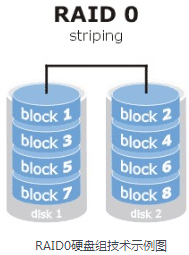
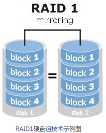
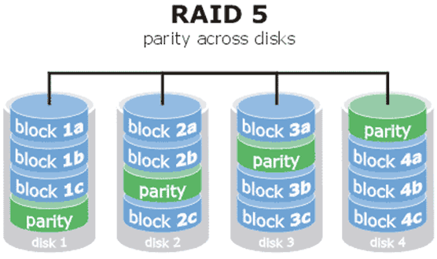
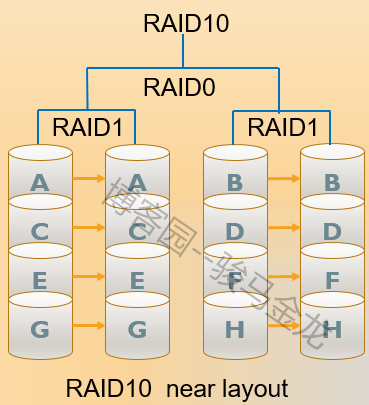

### RAID 概念

RAID 独立磁盘冗余阵列（Redundant Array of Independent Disks），RAID 技术是将许多块硬盘设备组合成一个容量更大、更安全的硬盘组，可以将数据切割成多个区段后分别存放在各个不同物理硬盘设备上，然后利用分散读写需求来提升硬盘组整体的性能，同时将数据同步保存多份到不同的物理硬盘设备上。

### RAID 0

将数据依次分别写入到各个物理硬盘中，这样可以使得读写性能提升数倍，但若任意一块硬盘故障则会让整个系统的数据都受到破坏

### RAID 1

将两块以上的存储设备进行绑定，目的是让数据被多块硬盘同时写入，类似于把数据再制作出多份镜像，当有某一块硬盘损坏后，一般可以通过热交换方式来恢复数据的正常使用。

RAID 1 注重数据安全性，但因为多块硬盘写入相同的数据，导致硬盘空间真实可用率在理论上只有 50% ，提高了硬盘组成成本，因为同时写入到两块以上的硬盘设备，也就增加一定系统负载，RAID 1 因为一份数据保存多份，所以读性能是和 RAID 0 一样。

### RAID 5

 RAID 5 兼顾三者

### RAID 10

RAID 10 需要至少 4 块硬盘，先分别两两制作成 RAID 1，保障数据的安全性，再对两个 RAID 1 实施 RAID 0 技术，进一步提高存储设备的读写速度，这样理论上只要坏的不是同一组中的所有硬盘，那么最多可以损坏 50% 的硬盘设备而不丢失数据，在不考虑成本的情况下 RAID 10 在读写速度和数据保障性方面都超过了 RAID 5，是使用较为广泛的存储技术。

RAID 10 的三种复制方法 near、far、offset。

 

