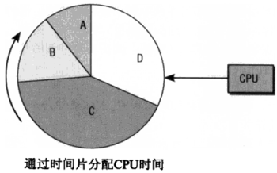
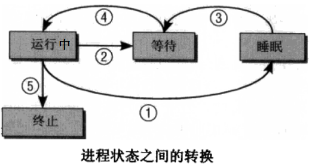

### 进程和程序的区别

程序是二进制文件，是静态存放再磁盘上的，不会占用系统运行资源（cpu/内存）

进程是用户执行程序或者触发程序的结果，可以认为进程是程序的一个运行实例。进程是动态的，会申请和使用系统资源，并与操作系统内核进行交互。

### 多任务和cpu时间片

现在所有的操作系统都能同时运行多个进程，也就是多任务或者说是并行执行，但这实际上是人类的错觉。一颗物理 CPU 在同一时刻只能运行一个进程，只有多颗物理 CPU 才能真正意义上实现多任务。

以为操作系统能并行做几件事情，这是通过在极短时间内进行进程间切换实现的，因为时间极短，前一刻执行的是进程 A，下一刻切换到进程 B，不断在多个进程间进行切换，使得让人以为在同时处理多件事情。

在 Linux 上，决定下一个要运行的进程是通过 调度类（调度程序）来实现的。程序何时运行，由进程的优先级决定，**优先级值越低，优先级就越高**，就越快被调度类选中。除此之外，优先级还影响分配给进程的时间长短。

在 Linux 中，改变进程的 nice 值，可以影响某类进程的优先级值。

CPU 时间片概念，如下图：

抢占式多任务处理：内核可以强制在时间片耗尽的情况下收回 CPU 使用权，并将 CPU 交给调度类选中的进程，此外，在某些情况下也可以直接抢占当前运行的进程。随着时间的流逝，分配给进程的时间也会被逐渐消耗，当分配时间消耗完毕时，内核收回此进程的控制权，并让下一个进程运行。但因为前面的进程还没有完成，在未来某个时候调度类还是会选中它，所以内核应该将每个进程临时停止时的运行时环境（寄存器中的内容和页表）保存下来（保存位置为内核占用的内存），这称为保护现场，在下次进程恢复运行时，将原来的运行时环境加载到 CPU 上，这称为恢复现场，这样 CPU 可以在当初的运行时环境下继续执行。

调度类选中下一个要执行的进程后，要进行底层的任务切换，也就时上下文切换，这一过程需要和 CPU 进程紧密的交互。**进程切换不应太频繁，也不应太慢，切换太频繁将导致 CPU 闲置在保护和恢复现场的时间过长，保护和恢复现场对人类或者进程来说是没有产生生产力的（因为它没有在执行程序）。切换太慢将导致进程调度切换慢，**很可能下一个进程要等待很久才能轮到它执行。

CPU 的衡量单位是时间，就像内存的衡量单位是空间大小一样。进程占用的 CPU 时间长，说明 CPU 运行在它身上的时间就长。CPU 的百分比值不是其工作强度或频率高低，而是**进程占用 CPU 时间/ CPU 总时间**。

### 父子进程及创建进程的方式

根据执行程序的用户 UID 以及其他标准，会为每一个进程分配一个唯一的 PID

父子进程的概念，简单来说，在某进程（父进程）的环境下执行或调用程序，这个程序触发的就是子进程，而进程的 PPID 表示的是该进程的父进程的 PID，所以 **子进程总是由父进程创建**

在 Linux ，父子进程以树型结构的方式存在，父进程创建出来的多个子进程之间称为兄弟进程，Centos 6 上，init 进程是所有进程的父进程，Centos 7 上则为 systemd。

Linux 上创建子进程的方式有三种：**1. fork 出来的进程 2. exec 出来的进程 3. clone 出来的进程**

1. fork 是复制进程，它会复制当前进程的副本（不考虑写时复制的模式），以适当的方式将这些资源交给子进程。所以子进程掌握的资源和父进程一样，包括内存中的内容，也包括环境变量和变量，但父子进程是完全独立的，它们是一个程序的两个实例。
2. exec 是加载另一个应用程序，替代当前运行的进程，也就是说在不创建新进程的情况下加载一个新程序，exec 还有一个动作，在进程执行完毕后，退出所在环境，所以为了保证进程安全，若要形成新的且独立的子进程，都会在 fork 出来的子进程上调用 exec 来加载新程序替代该子进程。例如在 bash 下执行 cp 命令，会先 fork 出一个 bash ，然后再 exec 加载 cp 程序覆盖子 bash 进程变成 cp 进程，但要注意，fork 进程时会复制所有内存页，但使用 exec 加载新程序时会初始化地址空间，意味着复制动作完全是多余的操作，有了写时复制技术不用过多考虑这个问题。
3. clone 用于实现线程。clone 工作原理和 fork 相同，但 clone 出来的新进程不独立于父进程，它只会和父进程共享某些资源，在 clone 进程的时候，可以指定要共享的是哪些资源。

一般情况下，兄弟进程之间是相互独立、互不可见的，但有时候通过特殊手段，它们会实现进程间通信。例如管道协调了两边的进程，两边的进程属于同一个进程组，它们的 PPID 是一样的，管道使得它们可以以 管道的方式传递数据。

进程是有所有者的，也就是它的发起者，某个用户如果它非进程发起者、非父进程发起者、非 root 用户，那么它无法杀死进程。且杀死父进程（非终端进程），会导致子进程变成孤儿进程，孤儿进程的父进程总是 init/systemd。

### 进程的状态

运行态 ：进程正在运行，也即 CPU 正在它身上

等待（就绪）态 ：进程可以运行，已经处于等待队列中，也就是说调度类下次可能会选中它

睡眠（阻塞）态 ：进程睡眠，不可运行

各个状态之间转化方式

1. 新状态 → 就绪态 ：当等待队列允许接纳新进程时，内核便把新进程移入等待队列
2. 就绪态 → 允许态 ：调度类选中等待队列中的某个进程，该进程进入运行态
3. 运行态 → 睡眠态 ：正在运行的进程因需要等待某件事（如 IO 等待、信号等待等）的出现而无法执行，进入睡眠态
4. 睡眠态 → 就绪态 ：进程所等待的事件发生了，进程就从睡眠态排入等待队列，等待下次被选中执行
5. 运行态 → 就绪态 ：正在执行的进程因时间片用完而被暂停执行，或者在抢占式调度方式中，高优先级进程强制抢占了正在执行的低优先级进程。
6. 运行态 → 终止态 ：一个进程已完成或发生某种特殊时间，进程将变为终止状态。对于命令来说，一般都会返回退出状态码。

### 进程结构和子 Shell

前台进程：一般命令（如 cp）在执行时会 fork 子进程来执行，在子进程执行过程中，父进程会进入睡眠，这类事前台进程。

后台进程：在执行命令是，在命令的结尾加上符号 `&` ，会进入后台，并返回该后台进程的 `jobid` 和 `pid` ，当后台进程出错或者执行完成，父进程会收到信号。

bash 内置命令：bash 内置命令非常特殊，父进程不会创建子进程来执行这些命令，而是直接在当前的 bash 进程中执行，如果将内置命令放在管道后，则此内置命令将和管道左边的进程同属于一个进程组，所以仍然会创建子进程。

两种特殊的脚本调用方式：exec 和 source（也可以用 `.` 代替）

- exec ：exec 是加载程序替换当前进程，所以不开启子 shell，而是直接在当前 shell 中执行命令或脚本，执行完 exec 后直接退出 exec 所在的 shell。
- source ：source 一般用来加载环境配置类脚本。它不会开启子 shell ，直接在当前 shell 中执行调用脚本且执行脚本后不退出当前 shell，所以脚本会继承当前已有的变量，且脚本执行完毕后加载的环境变量会沾滞给当前 shell，在当前 shell 生效。

### 终端和进程的关系

保证退出终端后，在该终端上的进程继续执行的方法：

1. nohup 带上要执行的命令或脚本放入后台，这样就使得任务脱离了终端的关联。当终端退出时，该任务自动挂在到了 init 或 systemd 进程下执行
2. screen 该工具可以模拟多个物理终端，当其所在终端退出后将自动挂到 init/systemd 进程下继续存在，只有 screen 进程仍存在，其所模拟的物理终端就会一直存在。一般对于简单的后台持续运行进程，使用 nohup 就够了。

### 信号

信号在操作系统中控制着进程的绝大多数动作，信号可以让进程知道某个事件发生了，也指示着进程下一步要做出什么动作。信号的来源可以是硬件信号（如按下键盘或硬件故障），也可以是软件信号（如 kill 信号，还有内核发送的信号）

Linux 支持多种信号，它们都已 SIG 字符串开头，SIG 字符串后才是真正的信号名称，信号还有对应的数值，其实数值才是操作系统认识的信号，由于不少信号在不同架构的计算机上数值不同（例如 CTRL+Z 发送的 SIGSTP 信号就有三种值 18，20，24），所以在不确定信号数值是否唯一的时候，最好指定其字符名称。

| Signal | Value | Comment |
| :----: | :---: | :-----: |
| SIGHUP | 1     | 终端退出时，此终端内的进程都将被终止 |
| SIGINT | 2 | 中断进程，可被捕捉和忽略，几乎等同于 sigterm，所以也会尽可能的释放执行 clean-up，释放资源，保存状态等|
| SIGQUIT | 3 | 从键盘发出杀死（终止）进程的信号 |
| SIGKILL | 9 | 强制杀死进程，该信号不可被捕捉和忽略，进程收到该信号后不会执行任何 clean-up 行为，所以资源不会释放，状态不会保存 |
|SIGTERM | 15 | 杀死（终止）进程，可被捕捉和忽略，几乎等同于 sigint 信号，会尽可能的释放执行 clean-up，释放资源，保存状态等 |
| SIGCHLD | 17 | 当子进程中断或退出时，发送该信号告知父进程自己已完成，父进程收到信号将告知内核清理进程列表。所以该信号可以解除僵尸进程，也可以让非正常退出的进程工作得以正常的 clean-up ，释放资源，保存状态等。 |
| SIGSTOP | 19 |该信号是不可被捕捉和忽略的进程停止信息，收到信号后会进入 stopped 状态 |
| SIGTSTP | 20 | 该信号是可被忽略的进程停止信号（CTRL+Z）|
| SIGCONT | 18 | 发送此信号使得 stopped 进程进入 running，该信号主要用于 jobs，例如 bg & fg 都会发送该信号。可以直接发送此信号给 stopped 进程使其运行起来 |
| SIGUSR1 | 10 | 用户自定义信号1 |
| SIGUSR2 | 12 | 用户自定义信号2 |

特殊信号：代码为 0 的信号。此信号为 EXIT 信号，表示直接退出。如果 kill 发送的信号是 0，则表示不做任何处理直接退出，但执行错误检查：当检查发现给定的 pid 进程存在，则返回 0 ，否则返回 1。也就是，0 信号可以用来检测进程是否存在，可以代替 `ps aux | grep proc_name`  。

此外经常看到有些服务程序（httpd/nginx）的启动脚本是有 WINCH 和 USR1 这两个信号，发送这两个信号它们分别表示 `graceful stop` 和 `graceful restart` ，它对于后台服务程序而言，传达了几个意思：

1. 当前已经运行的进程不再接受新请求
2. 给当前正在运行的进程足够多的时间去完成正在处理的事情
3. 允许启动新进程接受新请求
4. 可能还有日志文件是否应该滚蛋、pid 文件是否修改的可能

SIGWINCH 是窗口程序的尺寸改变时发送的信号，如 vim 的窗口改变就会发送该信号。但是对于后台服务程序，它们没有窗口，所以 WINCH 信号对它们来说是没有任何作用的，因此约定俗成，都会用它作为后台服务程序的 GRACEFUL 信号

### SIGHUP

1. 当控制终端退出时，会向该终端中的进程发送 sighup 信号，因此该终端上运行的 shell 进程、其他普通进程以及任务都会收到 sighup 而导致进程终止。
2. 对于 daemon 类的程序（即服务性进程）。这类程序不依赖终端（它们的父进程都是 init 或 systemd），它们收到 sighup 信号时会重读配置文件并重新打开日志文件，使得服务程序可以不用重启就可以加载配置文件。

### 僵尸进程和SIGCHLD

在子进程终止、退出的时候，会发送 SIGCHLD 信号给父进程，父进程收到信号就会通知内核清理该子进程相关信息。

在子进程死亡的那一刹那，子进程状态就是僵尸进程，但因为发出了 SIGCHLD 信号给父进程，父进程只要收到该信号，子进程就会被清理也就不再是僵尸进程。所以正常情况下，所有终止的进程都会有一小段时间处于僵尸态（发送 SIGCHLD）信号到父进程收到该信号之间，只不过这种僵尸进程存在时间极短，几乎不可被 ps 或 top 捕捉到。

解决僵尸进程的方法：

1. 杀死僵尸进程的父进程
2. 手动发送 SIGCHLD 信号给僵尸进程的父进程

kill ：可以手动发送信号给指定进程，默认信号为 TREM 

pkill 和 killall ：可以直接指定进程名来发送信号，不指定信号时，默认信号都是 TERM

fuser ：可以查看文件或目录所属进程的 pid，即由此知道该文件或目录被哪个进程使用

lsof ：可以通过进程来查看进程打开了哪些文件（注意 Linux 一切皆文件）

