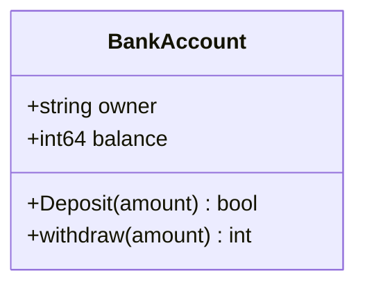
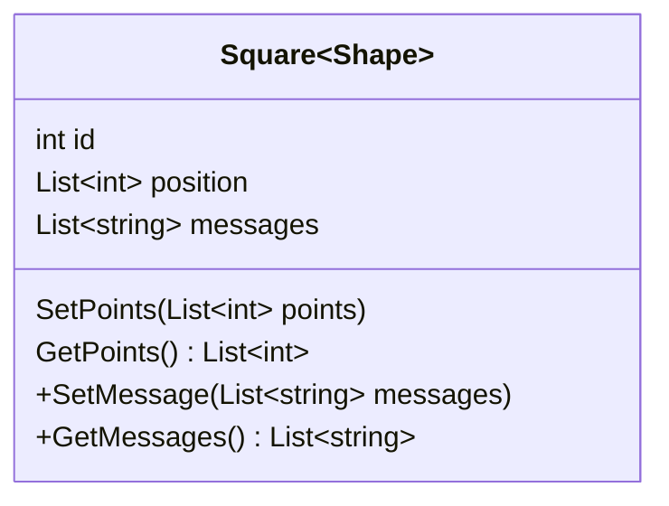
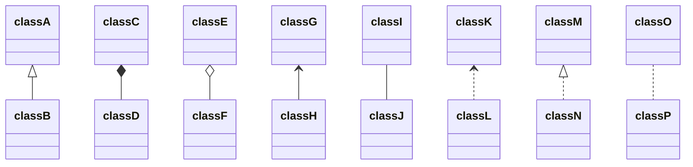
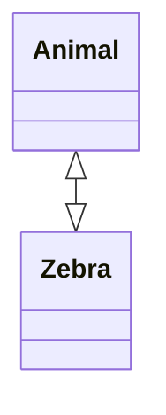
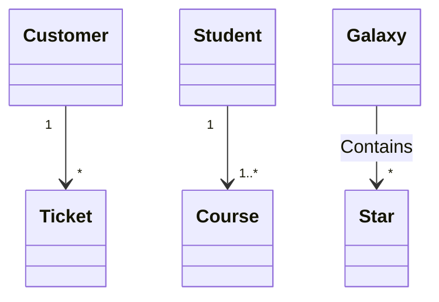
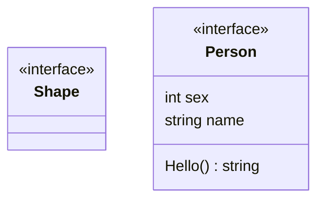

## UML类图



### 泛型



### 关联关系

| **Type** | **Description** |
| -------- | --------------- |
| <--      | Inheritance 继承  |
| \*--      | composition 组合  |
| o--      | Aggregation 聚合  |
| -->      | Association 关联  |
| --       | 实线              |
| ..>      | Dependency 依赖   |
| ..\|>     | Realization 实现  |
| ..       | 虚线              |



### 双向关联



### 多重关联

可选的基数

- 1：仅1个
- 0 .. 1：0 或 1
- 1 .. *：1 或 多
- *：多
- n：n个，n>1
- 0 .. n：0 或 n

语法：

```
classA "基数" 箭头 "基数" classB: text
```



### 类注解

- `<<Interface>>`
- `<<abstract>>`
- `<<Service>>`
- `<<enumeration>>`

