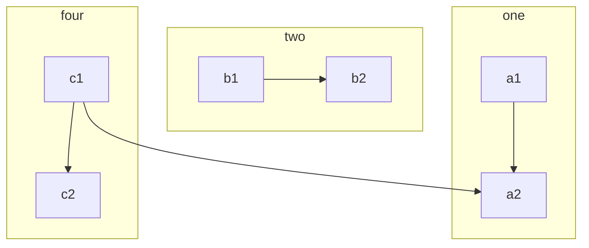
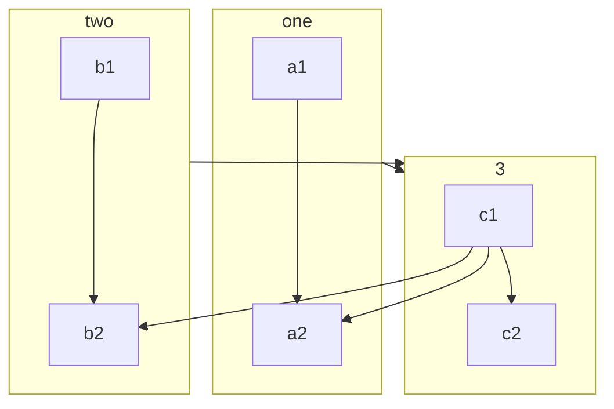
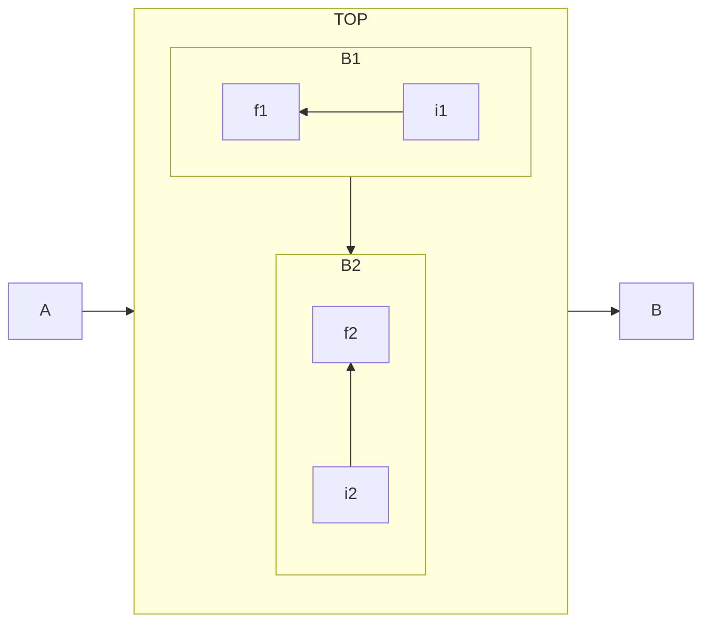

## 子图

```mermaid
flowchart TB
	c1 --> a2
	subgraph one
	a1 --> a2
	end
	subgraph two
	b1 --> b2
	end
	subgraph three [four]
	c1 --> c2
	end
```

```mermaid
flowchart TB
	subgraph one
	a1 --> a2
	end
	subgraph two
	b1 --> b2
	end
	subgraph 3
	c1 --> c2
	end
	one --> 3
	two --> 3
	c1 --> a2 & b2
	
```

### 嵌套子图

```mermaid
flowchart LR
	subgraph TOP
		direction TB
		subgraph B1
			direction RL
			i1 --> f1
		end
		
		subgraph B2
			direction BT
			i2 --> f2
		end
	end
	
	A --> TOP --> B
	B1 --> B2
```
