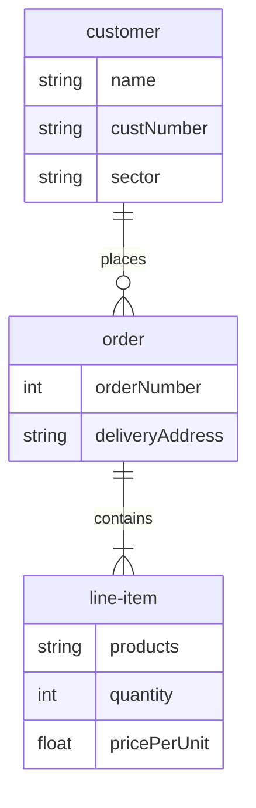
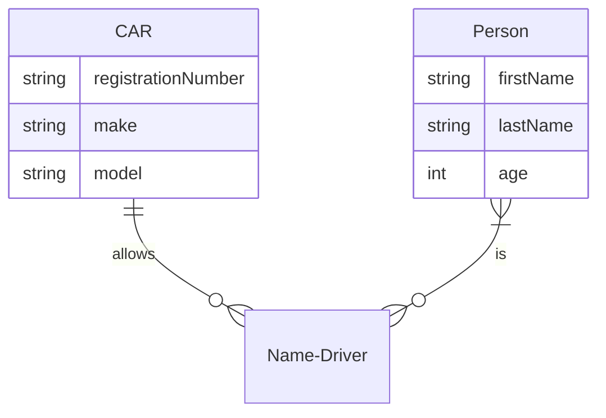

## 实体关系图 Entity Relationship Diagrams

| Value left | value right | description |
| ---------- | ----------- | ----------- |
| \|o | o\| |0 或1 |
| \|\| \|\| | 仅一个 |
| )o | o( | 0个或多个 |
| }\| \|{ | 一个或多个 |

