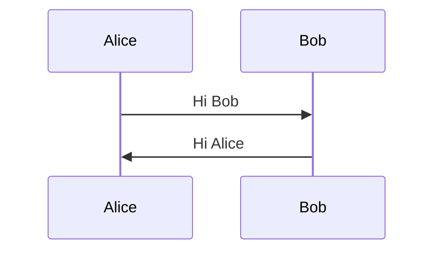
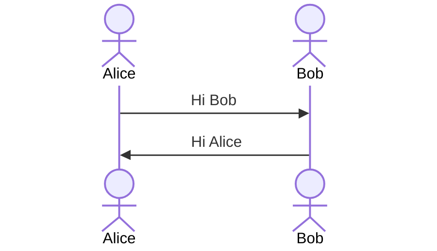
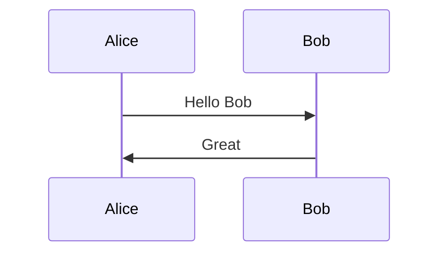
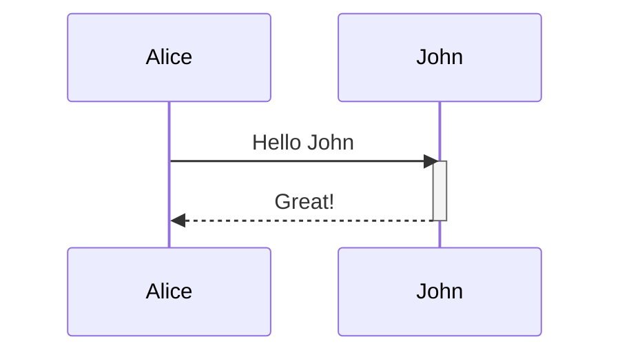
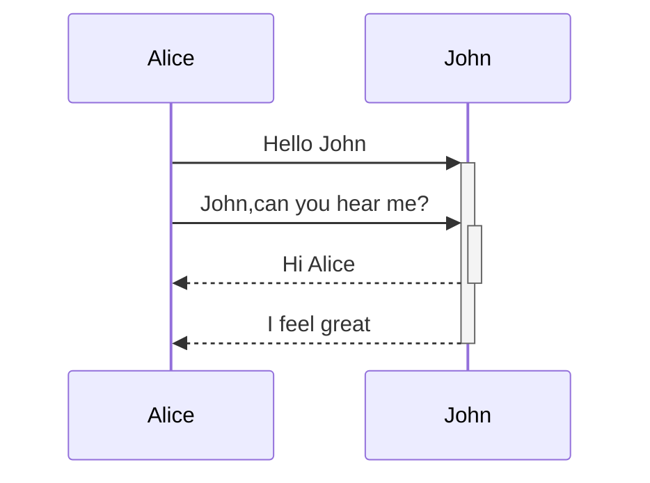
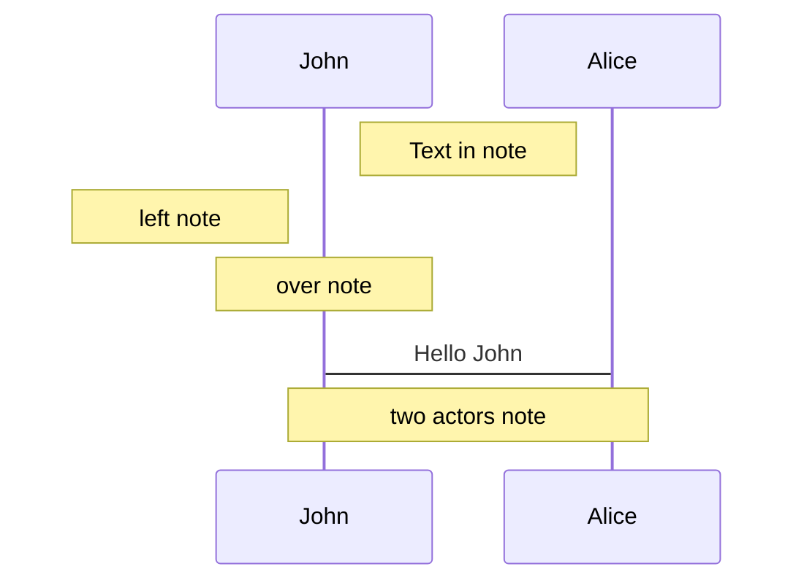
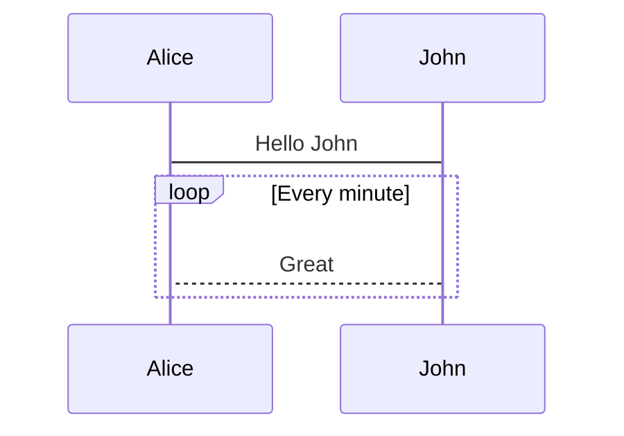
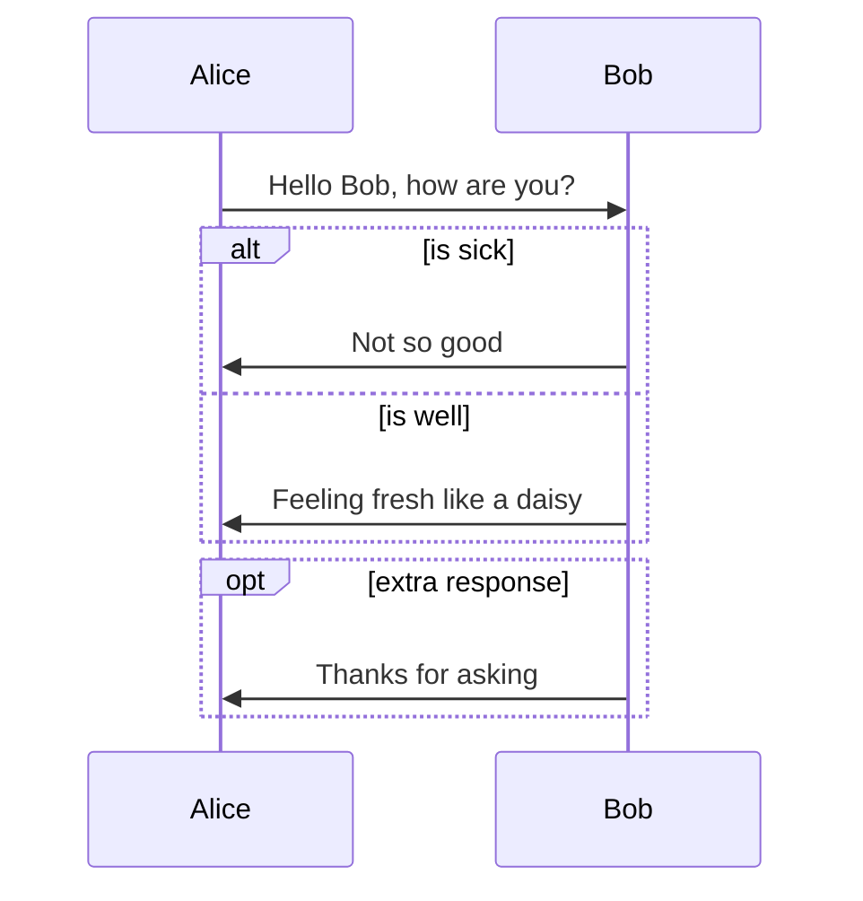
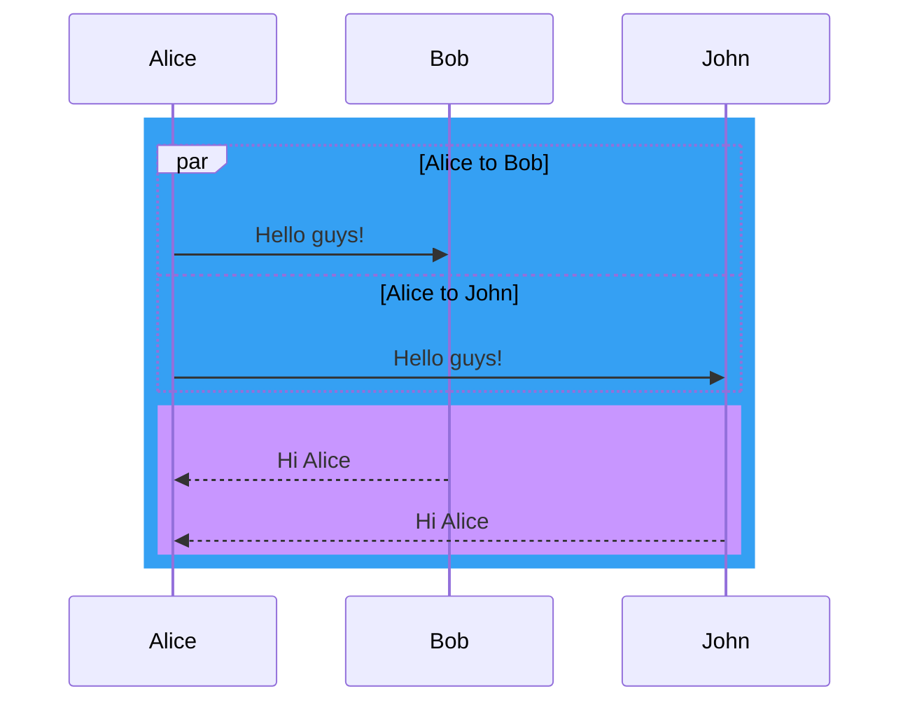

## 时序图

### participant



### actors



### aliases



### 线段类型

| **Type** | **Description** |
| -------- | --------------- |
| ->       | 实线没有箭头          |
| -->      | 虚线没有箭头          |
| ->>      | 实线带箭头           |
| -->>     | 虚线带箭头           |
| -x       | 实线箭头尾端带有一个x     |
| --x      | 虚线箭头尾端带有一个x     |
| -)       | 实线带有一个开放箭头      |
| --)      | 虚线带有一个开放箭头      |

### 激活


可以使用 + - 替代


### 备注
语法：`Note [right of| left of| over] [Actor]: Text`


### loops 循环
语法
```
loop text
... statements ...
end
```



### Alt、opt
alt 相当于 if else
opt 可选


### parallel 并行
