## 流程图

- graph 或 graph TB 或 graph TD：从上往下
- graph BT：从下往上
- graph LR：从左往右
- graph RL：从右往左

### 节点交互

通过配置 `securityLevel='[strict|loose]'` 可以在点击一个结点时触发回调函数

```
click nodeID callback
click nodeID call callback
```

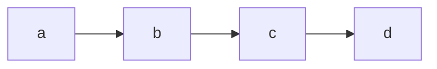


### 结点形状

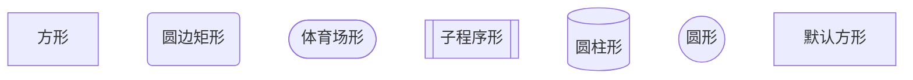

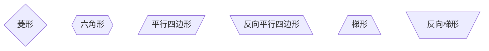


### 连线样式

- 开放连接

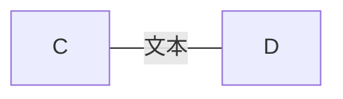

- 实线箭头

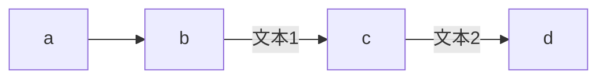

- 粗实线箭头

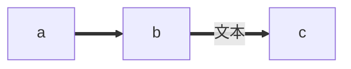

- 虚线

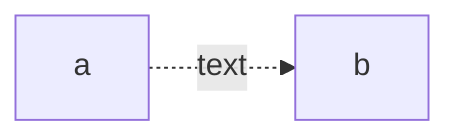

- 互相链接的线

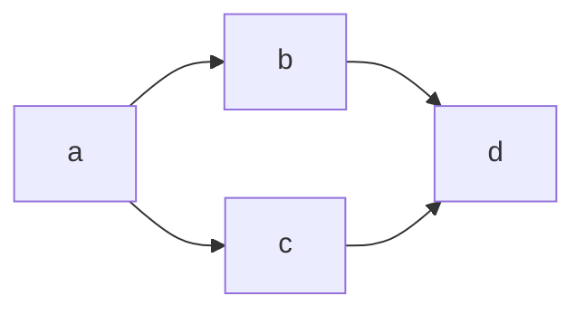

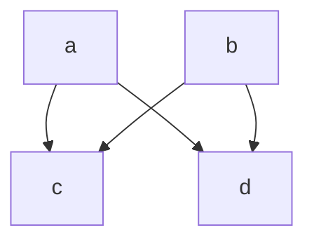

- 不同的结点类型

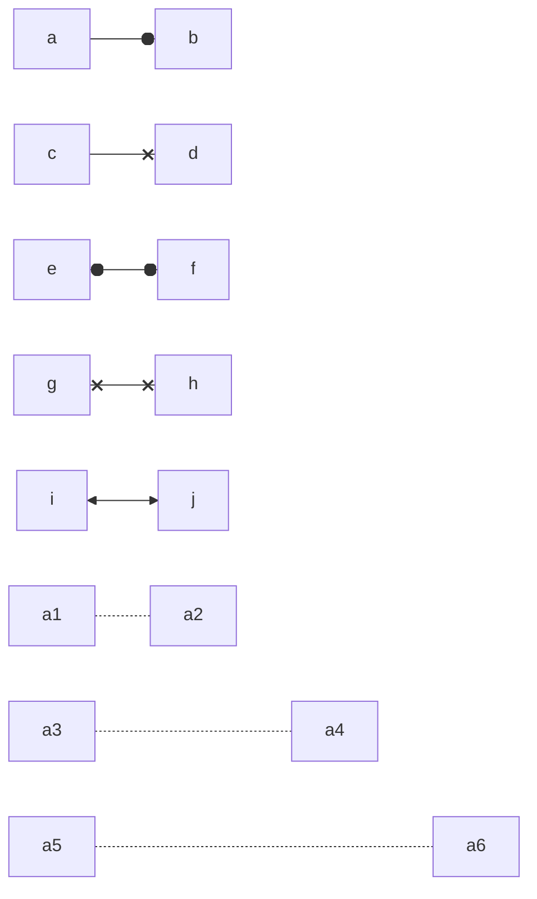

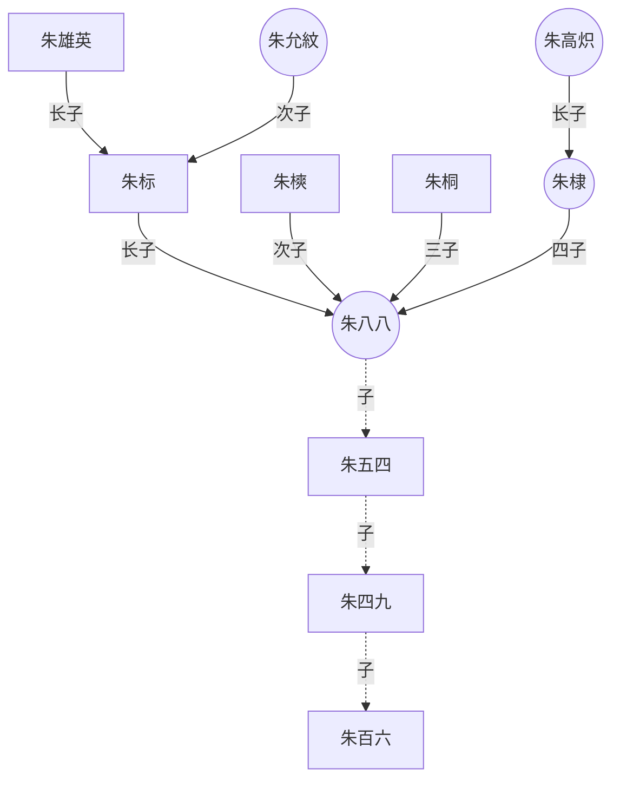

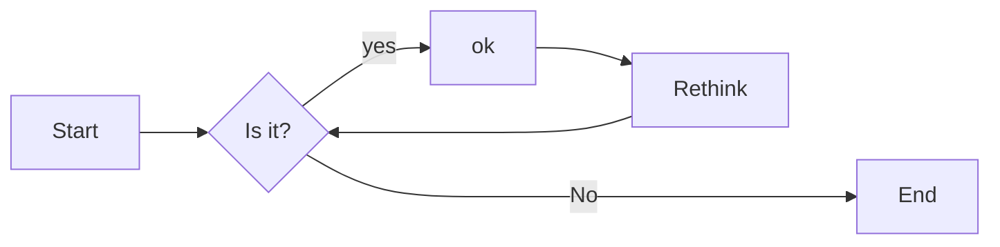

### 节点样式

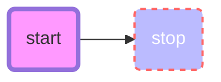

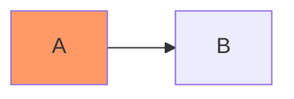
