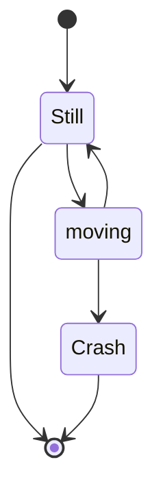
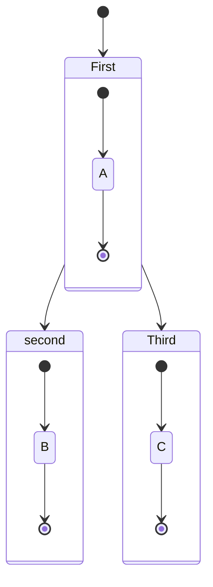
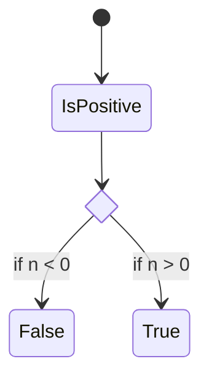
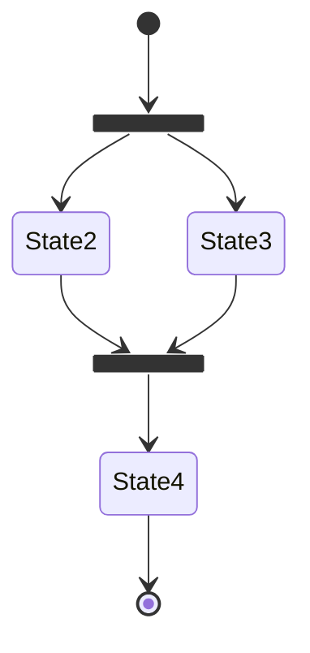
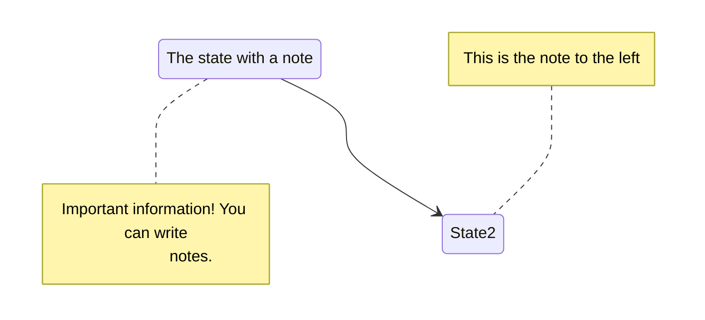
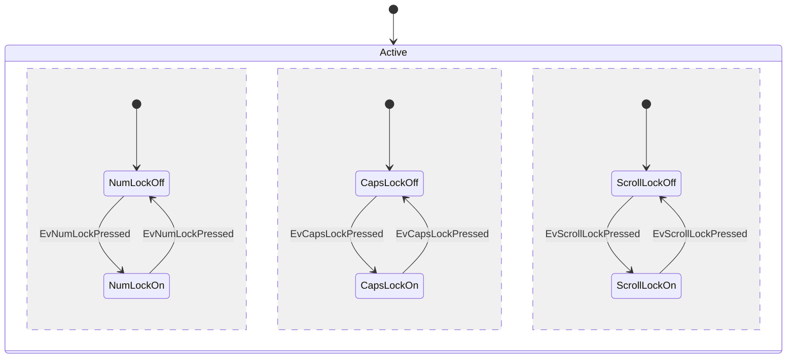

## 状态图

```mermaid
stateDiagram-v2
	[*] --> Still
	Still --> [*]
	
	Still --> moving
	moving --> Still
	moving --> Crash
	Crash --> [*]
```

### 组合状态

```mermaid
stateDiagram-v2
	[*] --> First
	state First {
		[*] --> A
		A --> [*]
	}
	
	state second {
		[*] --> B
		B --> [*]
	}
	
	state Third {
		[*] --> C
		C --> [*]
	}
	
	First --> second
	First --> Third
```

### 可选

```mermaid
stateDiagram-v2
	state if_state <<choice>>
	[*] --> IsPositive
	IsPositive --> if_state
	if_state --> False: if n < 0
	if_state --> True: if n > 0
```

### 分叉

```mermaid
stateDiagram-v2
	state fork_state <<fork>>
	[*] --> fork_state
	fork_state --> State2
	fork_state --> State3
	
	state join_state <<join>>
	State2 --> join_state
	State3 --> join_state
	join_state --> State4
	State4 --> [*]
```

### 备注

```mermaid
stateDiagram-v2
	State1: The state with a note
	note right of State1
		Important information! You can write
		notes.
	end note
	
	State1 --> State2
	note left of State2: This is the note to the left
```

### 并发

```mermaid
stateDiagram-v2
	[*] --> Active
	
	state Active {
		[*] --> NumLockOff
		NumLockOff --> NumLockOn: EvNumLockPressed
		NumLockOn --> NumLockOff: EvNumLockPressed
		
		--
		[*] --> CapsLockOff
		CapsLockOff --> CapsLockOn: EvCapsLockPressed
		CapsLockOn --> CapsLockOff: EvCapsLockPressed
		
		--
		[*] --> ScrollLockOff
		ScrollLockOff --> ScrollLockOn: EvScrollLockPressed
		ScrollLockOn --> ScrollLockOff: EvScrollLockPressed
		
	}
```