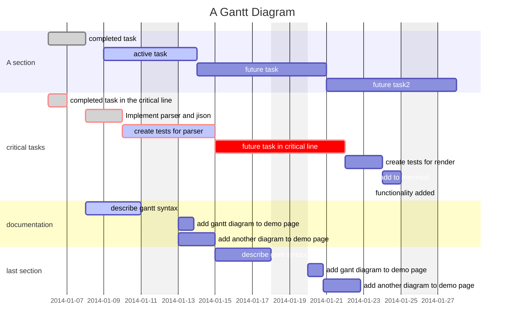

## 甘特图 Gantt

```mermaid
gantt
	title A Gantt Diagram
	dateFormat YYYY-MM-DD
	excludes weekends
	%% excludes 接受 monday - sunday,weekends
	
	section A section
	completed task						:done, des1, 2014-01-06, 2014-01-08
	active task							:active,	des2,	2014-01-09,	3d
	future task							:des3,	after des2,	5d
	future task2						:des4,	after des3,	5d
	
	section critical tasks
	completed task in the critical line	:crit,	done,	2014-01-06,	24h
	Implement parser and jison			:crit,	done,	after des1,	2d
	create tests for parser				:crit,	active,	3d
	future task in critical line		:crit,	5d
	create tests for render				:2d
	add to mermaid						:1d
	functionality added					:milestones
	
	section documentation
	describe gantt syntax				:active,	a1,	after des1,	3d
	add gantt diagram to demo page		:after a1,	20h
	add another diagram to demo page	:doc1,	after a1,	48h
	
	section last section
	describe gant syntax				:after doc1,	3d
	add gant diagram to demo page		:20h
	add another diagram to demo page	:48h
```