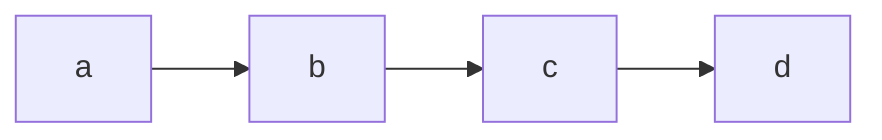

## 节点交互

通过配置 `securityLevel='[strict|loose]'` 可以在点击一个结点时触发回调函数

```
click nodeID callback
click nodeID call callback
```


```mermaid
flowchart LR
	a --> b
	b --> c
	c --> d
	click a callback "Tooltip for a callback"
	click b "https://www.github.com" "www.github.com"
	click a call callback() "tooltip for a callback"
	click b href "https://www.baidu.com" "www.baidu.com"
```
