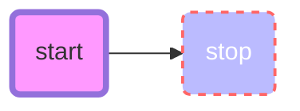
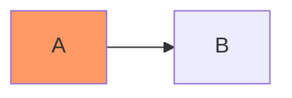

## 节点样式

```mermaid
flowchart LR
	id1(start) --> id2(stop)
	style id1 fill:#f9f,stroke-width:4px
	style id2 fill:#bbf,stroke:#f66,stroke-width:2px,color:#fff,stroke-dasharray: 5 5
```

```mermaid
flowchart LR
	classDef someclass fill:#f96
	A:::someclass --> B
```