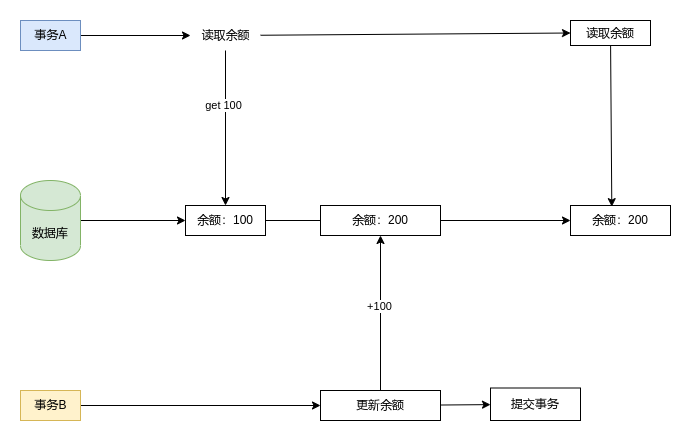

# 事务的特性

- 原子性（Atomicity）：通过 undo log（回滚日志）保证
- 隔离性（Isolation）：通过 MVCC（多版本并发控制）或锁机制
- 持久性（Durability）：通过 redo log（重做日志）保证
- 一致性（Consistency）由原子 + 隔离 + 持久保证一致性


开启事务的方式：
- `begin`
- `start transaction`，这个语句后面可以跟修饰符，如果有多个修饰符需要逗号分隔，
	- `read only`：只读事务
	- `read write`：既可以读取数据，也可以修改数据
	- `with consistent snapshot`：启动一致性读

提交事务 `commit`

中止事务 `rollback`

保存点，在事务中打点就可以回滚到指定的保存点

```mysql
# 创建保存点
savepoint 保存点名称

# 回滚至某个保存点
rollback to 保存点名称

# 删除保存点
release savepoint 保存点名称
```

# 事务隔离级别

- Read Uncommitted：未提交读
- Read Committed：提交读
- Repeatable Read：可重复读
- Serializable：串行化

| 隔离级别 | 脏读 | 不可重复读 | 幻读 |
| -------- | ---- | ---------- | ---- |
| 未提交读 | √ | √ | √ |
| 提交读 | × | √ | √ |
| 可重复读 | × | × | √ |
| 串行化 | × | × | × | 

# 事务并发执行时的一致性问题

## 脏写（Dirty Write）

如果一个事务修改了另一个未提交事务修改过的数据，意味着发生了脏写

## 脏读（Dirty Read）

如果一个事务读到了另一个未提交事务修改过的数据，意味着发生了脏读

## 不可重复读（Non Repeatable Table）

一个事务内多次读取同一个数据，如果出现前后两次读到的数据不一致的情况，意味着发送不可重复读


## 幻读（Phantom）

在一个事务内多次查询某个符合查询条件的记录数量，如果出现前后两次查询到的记录数量不一样的情况，意味着发生了幻读。
例：当事务 A 第一次查询金额>100 的记录数量为 5 时，事务 B 此时插入一条>100 的记录，事务 A 再次以同样的条件查询时，记录数量变为 6，前后查询数量不一致时，就被称为幻读。

>[!tip]
>MySQL 默认隔离级别为可重复读，在很大程度上避免了幻读（并不是完全避免），解决方案：
>- 快照读：普通 select 语句，通过 MVCC 方式解决幻读。在可重复读级别下，事务执行过程中看到的数据一直是一致的，即使中途有其他事务提交也不会看到，所以避免了幻读。
>- 当前读：`select ... for update| insert | update | delete` 都是当前读，会加上 next-key lock（记录锁 + 间隙锁），其他事务在 next-key 范围插入数据时，会被阻塞

### MySQL 可重复读不能完全避免幻读的场景

```mysql
# 表结构如下
create table t_user(
	id int primary key not null,
	name varchar(20) not null default '',
	age int not null default 0,
);

insert t_users values (1,"小黑",18),(2,"小明",20);
```

```mysql
# 事务A
begin;
select * from t_users where id = 3; # 1. 第一次查询不到

update t_users set age = 177 where id = 3; # 3. 更新一条select不到的记录，因为update是当前读，所以会发生更新

select * from t_users where id = 3; # 4. 再次查询可以查到此条记录

```

```mysql
# 事务B
begin;
insert t_users values(3, "小红",17); # 2. 事务B插入一条id=3的记录
commit;
```

原因：
>在事务 A 使用 update（当前读）更新一条不存在的记录时，会将该条记录上的 trx_id 更新为当前事务的 id，因此再次查询时就能查询到了。

>[!tip]
>为了避免此类特殊场景，应该在开启事务之后，马上执行 `select ... for update` 这类当前读语句，因为当前读语句会对记录加 `netx-key lock`，从而避免其他事务插入一条新记录

# MVCC

## 事务版本号

每开启一个日志，都会从数据库中获得一个事务 ID，这个 ID 是自增的，通过 ID 大小，可以判断事务的时间顺序。

## 版本链

每次对记录的改动都会产生一个 undo 日志，每条 undo 日志有一个 roll_pointer 字段，通过这个字段可以将 undo 日志串成一个链表
![[Pasted image 20220330034145.png]]

## ReadView

MySQL 会创建一个 readview，访问的时候以 readview 的逻辑结果为准。
- 可重复读：在事务启动时创建，整个事务期间都用这个 readview
- 提交读：在每个语句执行前都会生成一个 readview

![[../../assets/mysql/InnoDB/事务/IMG-20231121194725353.png]]

readview 包含四个属性：

- m_ids：创建 Read View 时，当前数据库中活跃事务（启动了但还没提交的事务）ID 列表
- min_trx_id：创建 Read View 时，当前数据库中活跃事务中最小的事务 id，即 m_ids 中最小的值
- max_trx_id：创建 Read View 时，当前数据库中应该分配给下一个事务的 id 值

>[!note] trx_id
> 注意 max_trx_id 并不是 m_ids 中的最大值，事务 id 是递增分配的。比方说现在有 id 为 1，2，3 这三个事务，之后 id 为 3 的事务提交了。那么一个新的读事务在生成 ReadView 时，m_ids 就包括 1 和 2，min_trx_id 的值就是 1，max_trx_id 的值就是 4

- creator_trx_id：生成该 readview 的事务的事务 ID

#### 判断某个版本记录是否可见

- 可访问：
	- 访问记录 trx_id 与 readview 中的 creator_trx_id 值相同，表示当前事务在访问它自己修改过的记录，该版本记录可被当前事务访问
	- 访问记录 trx_id 小于 readview 中的 min_trx_id 值，表示该版本记录的事务在当前事务生成 readview 时已经提交，所以该版本记录可被当前事务访问
	- 访问记录 trx_id 在 readview 的 min_trx_id 和 max_trx_id 之间，且 trx_id 不在 m_ids 中，则说明在创建 readview 时，该版本记录已被提交，所以该版本记录可以访问。
- 不可访问：
	- 访问记录 trx_id 大于等于 readview 的 max_trx_id 值，表示生成该版本记录的事务在当前事务生成 readview 后才开启，所以该版本记录不可被当前事务访问
	- 记录 trx_id 在 readview 的 mid_trx_id 和 max_trx_id 之间，且 trx_id 在 m_ids 中，表示在创建 readview 时，该版本记录还是活跃事务，所以该版本记录不可见

如果某个版本的数据对当前事务不可见的话，就顺着版本链找到下一个版本，继续按照上面的逻辑进行判断，直到最后一个版本，如果最后一个版本也不可见，则意味着该条记录对该事务完全不可见，就不会查询到结果。

