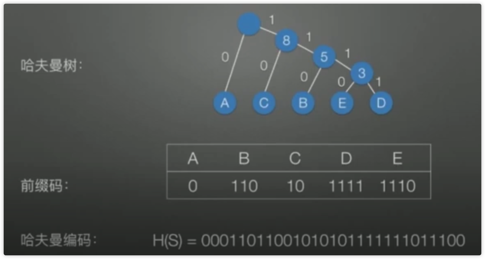

## 树(Tree)的定义

树（Tree）是 n（n>=0) 个节点的有限集。当 n = 0 时，称为空树。在任意一棵非空树种，有如下特点：

- 有且仅有一个特定的称为根（Root）节点
- 当 n > 1时，其余节点可分为 m（m>0) 个互不相交的有限集 T1、T2、。。。。Tm，其中每一个集合本身又是一棵树，并且称为根的子树（SubTree）

![[Pasted image 20220210145537.png]]
- 节点4的上一级节点是父节点（parent）
- 节点4衍生出来的节点是孩子节点（child）
- 与节点4同级是兄弟节点（sibling）
- 树的最大层级称为树的高度或深度，上图树高度为4

## 二叉树（binary tree）
二叉树的每个节点最多有2个孩子节点

1. 在二叉树的第i层上至多有$2^{i-1}$节点，如：第1层有 $2^{1-1}=1$，第二层有 $2^{2-1} = 2$
2. 高度为k的二叉树最多有$2^{k-1}$个节点
3. 对任何一棵二叉树T，如果其终端结点数为$n_0$，度为2的节点数为$n_2$，则 $n_0=n_2+1$

### 树的遍历

深度优先遍历：

- 先序遍历：根节点、左子树、右子树
- 中序遍历：左子树、根节点、右子树
- 后序遍历：左子树、右子树、根节点

广度优先遍历
- 层序遍历

### 满二叉树
一个二叉树的所有非叶子节点都存在左右孩子，并且所有叶子节点都在同一层级上，那么这个树就是满二叉树。

### 完全二叉树
一个有n个节点的二叉树，按层级顺序编号，则所有节点的编号为从1到n。如果这个树所有节点和同样深度的满二叉树编号为从1到n的节点位置相同，则这个二叉树为完全二叉树。

### 树的存储结构
二叉树的存储分为：链式存储和数组
在使用数组存储时，一个父节点的下标为 i，它的左孩子节点下标是$2*i+1$，右孩子节点下标是$2*i+2$。二叉堆最适合使用数组存储。

### 二叉查找树(binary search tree)
查找树在二叉树的基础上增加了几个条件：
- 如果左子树不为空，则左子树上所有节点的值均小于根节点的值
- 如果右子树不为空，则右子树上所有节点的值均大于根节点的值
- 左右子树也都是二叉查找树

### 二叉堆
二叉堆本质上是一种完全二叉树，分为两个类型：
- 最大堆：任何一个父节点的值，都大于或等于它左、右孩子节点的值
- 最小堆：任何一个父节点的值，都小于或等于它左、右孩子节点的值

````ad-example
title: 最小堆

```ad-example
title: 上浮
~~~go
func UpAdjust(array []int) {
    childIndex := len(array) - 1
    parentIndex := (childIndex - 1) / 2
    temp :=  array[childIndex]

    for childIndex > 0 && temp < array[parentIndex] {
        array[childIndex] = array[parentIndex]
        childIndex = parentIndex
        parentIndex = (parentIndex - 1) / 2
    }

    array[childIndex] = temp
}

// 输入：[1,3,2,6,5,7,8,9,10,0]
// 输出：[0 1 2 6 3 7 8 9 10 5]
~~~
```

```ad-example
title: 下沉和构建
~~~go
// DownAdjust 下沉调整
// array 待调整的堆
// parentIndex 要下沉的父节点
// length 堆的有效大小
func DownAdjust(array []int, parentIndex int, length int) {
	temp := array[parentIndex]
	childIndex := 2*parentIndex + 1
	for childIndex < length {
		// 判断是否存在右节点，存在则与左节点进行比较
		if childIndex+1 < length && array[childIndex+1] < array[childIndex] {
			childIndex++
		}

		// 如果父节点小于任何一个孩子的值，则跳过
		if temp <= array[childIndex] {
			break
		}

		array[parentIndex] = array[childIndex]
		// 此时这个childIndex被当作一个父节点看，获取这个父节点的左字节点
		parentIndex = childIndex
		childIndex = 2*childIndex + 1
	}

	array[parentIndex] = temp
}

// BuildHeap 构建堆
// array 待调整的堆
// 输入：[7,1,3,10,5,2,8,9,6]
// 输出：[1 5 2 6 7 3 8 9 10]
func BuildHeap(array []int) {
	for i := (len(array) - 2) / 2; i >= 0; i-- {
		DownAdjust(array, i, len(array))
	}
}
~~~
```
````

#### 优先队列
- 最大优先队列：无论入队顺序如何，都是当前最大的元素优先出队
- 最小优先队列：无论入队顺序如何，都是当前最小的元素优先出队

````ad-example
title: 最大优先队列

~~~go
// 优先队列
type PriorityQueue struct {
	size int
	array []int
}

func NewPriorityQueue(size int) *PriorityQueue {
	return &PriorityQueue{
		array: make([]int, size),
	}
}

func (p *PriorityQueue) EnQueue(key int) {
	if p.size >= len(p.array) {
		p.resize()
	}

	p.array[p.size] = key
	p.size++
	p.upAdjust()
}

func (p *PriorityQueue) DeQueue() (int,error) {
	if p.size <= 0 {
		return 0,errors.New("the queue is empty")
	}

	head := p.array[0]
	p.size--
	p.array[0] = p.array[p.size]
	p.downAdjust()
	return head,nil
}

func (p *PriorityQueue) upAdjust() {
	childIndex := p.size-1
	parentIndex := (childIndex-1)/2
	temp := p.array[childIndex]

	for childIndex > 0 && temp > p.array[parentIndex] {
		p.array[childIndex] = p.array[parentIndex]
		childIndex = parentIndex
		parentIndex = (parentIndex - 1) / 2
	}

	p.array[childIndex] = temp
}

func (p *PriorityQueue) downAdjust() {
	parentIndex := 0
	temp := p.array[parentIndex]
	childIndex := 1

	for childIndex < p.size {
		if childIndex+1 < p.size && p.array[childIndex+1] > p.array[childIndex] {
			childIndex++
		}

		if temp >= p.array[childIndex] {
			break
		}

		p.array[parentIndex] = p.array[childIndex]
		parentIndex = childIndex
		childIndex = 2 * childIndex + 1
	}

	p.array[parentIndex] = temp
}

func (p *PriorityQueue) resize() {
	newSize := p.size * 2
	newArray := make([]int,newSize)
	copy(newArray,p.array)
	p.array = newArray
}
~~~
````


### 哈夫曼树

常用于不定长编码



定义：

- 路径：指从树中一个节点到另一个节点的分支所构成的路线

- 带权路径长度：节点具有权值（每个字符出现的次数），从该节点到根路径的长度乘以节点的权值，就是该节点的带权路径长度，例：E 的带权路径长度为：4（路径长度） * 2（权值） =  8

- 树的带权路径长度（WPL）：指树中所有叶子节点的带权路径长度之和

哈夫曼二叉树的特点：

  - 权值越大的节点，距离根节点越近
  - 树中没有度为 1 的节点，这类树叫做严格二叉树
  - 树的带权路径长度最短

  

