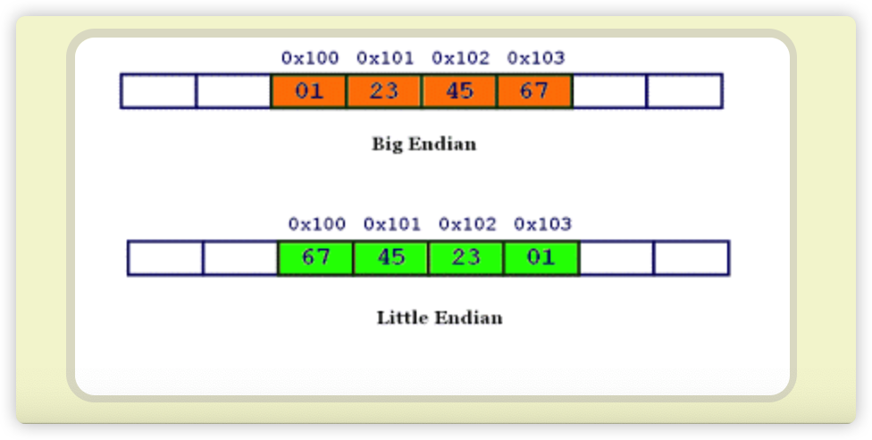

# 字节序

计算机硬件有两种存储数据的方式：

- 大端字节序（big endian）：高位字节在前，低位字节在后，一般用在网络传输
    
- 小端字节序（little endian）：低位字节在前，高位字节在后；因为计算机电路先处理低位字节，效率比较高
    

## 大小端
> 字节的大小端是只针对多字节的基础类型

如：uint32 整数 `0x11 22 33 44`
大端序：`0x11 0x22 0x33 0x44`
小端序：`0x44 0x33 0x22 0x11`
字节序处理惯例：
- 机器 CPU 处理一般都是小端
- 网络传输、磁盘存储默认大端