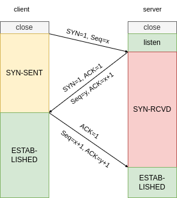
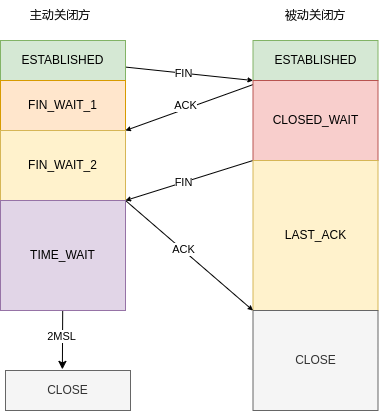

---
tags:
  - network
  - tcp
date created: 2023-03-07 00:46
date modified: 2023-11-09 00:38
updated: 2025-03-29
---

# 三次握手

1. 客户端初始化连接将 SYN 置为 1，Seq 赋值一个随机数，由 close->SYN-SENT
2. 服务端将 SYN 和 ACK 置为 1，服务端 Seq 赋值一个随机数，并将客户端传来的 Seq+1 赋值给 Acknowledgment Number（确认应答号），服务端 close->SYN-RCVD
3. 客户端将 ACK 置为 1，将服务端的 Seq+1 赋值给确认应答号，客户端进入 established（这一次握手时，就可以携带数据了）
4. 服务端收到客户端的报文后，服务端也进入 established

>[!note]
>TCP 三次握手时，Linux 内核会维护两个队列，分别是：
>- 半连接队列（SYN 队列）
>- 全连接队列（accept 队列）
> 
> 1. 当服务端收到客户端的 SYN 报文时，会创建一个半连接对象，将其加入到 SYN 队列
> 2. 然后发送 SYN-ACK 给客户端，等待客户端回应 ACK
> 3. 服务端收到 ACK，将半连接对象取出，然后创建一个新的连接对象放入到 Accept 队列
> 4. 应用通过调用 accept 函数，从 accept 队列取出连接对象

## SYN 攻击

会把 TCP 半连接队列打满后续收到的 SYN 报文就会丢弃，导致无法建立连接
避免 SYN 攻击的方式：
- 调大 `netdev_max_backlog`
- 增大 TCP 半连接队列
- 开启 tcp_syncookies
- 减少 SYN-ACK 重传次数

## 为什么是三次握手，而不是两次或四次

**三次握手才可以防止重复历史连接的初始化**

当客户端发起一个 SYN1（seq=90）时，因为网络阻塞的缘故，客户端宕机重启重新发起了另一个 SYN2（seq=100），SYN1 先到达服务端时，返回的 ACK（90+1），客户端比较与预期的 100+1 不匹配，会发送一个 RST。

如果是两次握手，就无法发起阻止历史连接，就会导致服务的的资源浪费。

**三次握手才可以同步双方的初始序列号**

TCP 连接维护一个序列号，作用是：
- 接收方可以去除重复的数据
- 接收方可以根据数据包的序列号按序接受
- 可以标识发送出去的数据包中，哪些是已经被对方接受到的

四次握手也可以实现同步序列号，因为服务端的 SYN 和 ACk 可以合并到一起，就优化成了 3 次握手

**三次握手才可以避免资源浪费**

# 四次挥手

- 主动方将 FIN 置为 1，发送报文后，进入 FIN-WAIT-1
- 被动方接受到 FIN 报文后，响应 ACK 报文，进入 CLOSE-WAIT
- 主动方收到被动方的 ACK 报文后，进入 FIN-WAIT-2
- 被动方发送完剩余数据后，发送 FIN 报文，进入 LAST_ACK
- 主动方接受到 FIN 报文，响应 ACK 报文，进入 TIME_WAIT
- 被动方收到 ACK 报文后，进入 close
- 主动发送完 ACK 后，在等待 2MSL 后，进入 close

## 客户端和服务端的不同状态分类

**发起方（客户端）**
- FIN_WAIT_1：客户端发送 FIN 报文段后进入次状态，等待接收方的 ACK 报文段。此时客户端已主动发起关闭连接请求，不再发送数据，但仍可接受数据。
- FIN_WAIT_2：客户端收到接收方的 ACK 报文段后进入此状态。此时客户端等待接收方发送 FIN 报文段，以完成连接的双向关闭。
- TIME_WAIT：客户端收到接收方的 FIN 报文段并发送 ACK 报文段后进入此状态。客户端会停留一段时间（通常是 2 倍 MSL），以确保 ACK 报文段能被接收方成功接收，同时等待网络中可能存在的未到达的相关报文段，防止出现数据混乱等问题。
- CLOSED：在 TIME_WATI 状态等待一段时间后，客户端进入 CLOSED 状态，标志着 TCP 连接彻底关闭，资源被释放。

**接收方（服务端）**
- CLOSE_WAIT：服务器收到客户端的 FIN 报文段后进入此状态。此时服务器通知应用程序客户端已请求关闭连接，服务器不再向客户端发送数据，但仍可接受客户端的数据，等待应用程序完成数据处理后发送 FIN 报文段。
- LAST_ACK：服务器发送 FIN 报文段后进入此状态，等待客户端的 ACK 报文段。一旦收到客户端的 ACK 报文段，服务器就可以进入 CLOSED 状态。
- CLOSED：服务器收到客户端的 ACK 报文段后，进入 CLOSED 状态，TCP 连接关闭，相关资源被释放。

## 为什么挥手需要 4 次

- 关闭连接时，主动方向被动方发送 FIN 时，仅表示主动方不再发送数据但还能接受数据
- 被动方收到主动方的 FIN 时，先回一个 ACK 报文，而被动方可能还有数据需要处理和发送，等被动方不再发送数据时，才发送 FIN 报文给主动方来表示同意现在关闭连接

通常被动方需要等待完成数据的发送和处理，所以被动方的 ACK 和 FIN 需要分开发送，因此需要四次挥手

>[!note]
>在特定情况下，四次挥手是可以变为三次的，当被动方收到 FIN 时，发现自己没有数据可以传输，可以直接调用关闭连接的函数
>这需要开启 TCP 延迟确认机制，这是默认开启的
>延迟确认机制的策略：
>- 当有响应数据时，ACK 会随着响应数据一起发送给对方
>- 当没有响应数据时，ACK 会延迟一段时间， 然后合并 ACK 和 FIN 报文一起发送
>- 如果在延迟等待发送 ACK 期间，对方的第二个报文到达，就会立刻发送 ACK

## Time Wait

### 为什么要等 2MSL

>[!note]
>TTL 一般设置为 64，Linux 将 MSL 设置为 30s，认为数据报经过 64 跳的时间不会超过 30s，超过了就认为报文消失了
>
>在一个 MSL 内，FIN 已经可以重传很多次了。只要有一个到达就会重置 timewait 定时器。当 n 个 FIN 包都丢了，再继续等也没有意义了。

- 如果最后一个 ACK 可以到达被动方，最多只需要等待 2MSL 即可保证网络中没有被动方重传的 FIN
- 如果最后一个 ACK 丢失，被动方在 MSL 内重传了 n 次
	- 重传的 FIN 有一个到达了主动方，主动方回复 ACK 后重置定时器，继续等待 2MSL
	- 如果重传的 FIN 都丢了，说明网络很差，再继续等也没有必要了。

### 为什么有 TIME_WAIT 状态

为了避免被动方没有收到或在收到 ACK 之前再次发起了一个 FIN，对潜在的新连接造成干扰。
- 防止历史连接中的数据，被后面相同四元组的连接错误接收
- 保证被动关闭方，能被正确的关闭

>[!tip]
>当服务器存在大量短链接，留下很多 TIME_WAIT 连接时。
>可以将 MSL 时间调短，开启 `tcp_tw_recycle` 和 `tcp_tw_reuse` 选项

